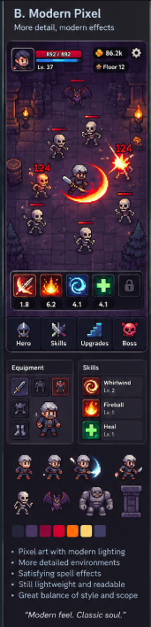

# IdleCombatz — visuel specifikation

**Status:** Bindende grundlag for den første implementation.  
**Visuelt facit:** Brugerens billede, “B. Modern Pixel”.  
**Mål:** Spillet skal ligne den viste spilskærm i komposition, pixelgrafik, materialer, farver, figurer, lys, effekter og UI. “Inspireret af” er ikke acceptkriteriet.

## 1. Referencen bestemmer udseendet

Originalen er gemt uændret i [`references/modern-pixel-reference.png`](references/modern-pixel-reference.png). Den er **171 × 708 pixels**. Filen er et præsentationsark med en spilskærm, ekstra komponenteksempler, sprites, farveprøver og forklarende tekst.

Dette dokument omsætter referencen til konkrete produktionsregler. Det er ikke en invitation til at redesigne den. Hvis en ny løsning afviger synligt fra referencen, skal den tilpasses referencen.

Der skelnes mellem:

- **Observation:** Et træk, der faktisk kan ses i billedet.
- **Produktionsmål:** En konkret størrelse, farveanvendelse eller animationsregel valgt for at genskabe dette træk i et spil.
- **Indholdstilpasning:** En nødvendig forskel, fordi prototypen har færre systemer end billedet viser.

Produktionsmål er ikke påstande om originalens kildefiler, font eller animationer. Især timinger og asset-dimensioner nedenfor er fastlagt til implementationen; de kan ikke måles ud fra et stillbillede.

## 2. Hvad billedets forskellige dele skal bruges til

Koordinaterne nedenfor er omtrentlige aflæsninger i originalens 171 × 708 pixels. Origo er øverst til venstre; intervaller beskriver synlige områder, ikke færdige asset-crops.

| Del | Omtrentligt område | Anvendelse |
|---|---|---|
| Titel og undertekst | y = 8–37 | Beskrivelse af stilen; vises ikke i spillet |
| Samlet spilskærm | x = 8–166, y = 47–397 | Facit for den primære komposition |
| Hero/HUD | y = 48–90 | Portræt, kompakte statusbjælker, gold og floor |
| Arena | y = 90–305 | Dungeon, figurer, fakler, damage-tal og spell-effekter |
| Ability-dock | y = 305–352 | Kvadratiske ikoner, rammer og cooldown-tal |
| Navigation | y = 357–397 | Fire kompakte faner med ikon over label |
| Equipment-/Skills-paneler | y = 406–502 | Materialer og tæthed for underpaneler |
| Løse sprites og props | y = 514–584 | Figurproportioner, animationseksempler og miljødetaljer |
| Farveprøver | y = 594–606 | Farvernes indbyrdes forhold |
| Punktliste og citat | y = 620–700 | Forklarende referenceindhold; vises ikke i spillet |

**Hele præsentationsarket må ikke blive én lang app-skærm.** Standardvisningen består af HUD, arena, ability-dock og navigation. Underpanelerne bliver indhold, man åbner fra navigationen. Sprite-rækken og farveprøverne er produktionsreferencer.

## 3. De træk, der skal være genkendelige med det samme

1. En smal, lodret dungeon med mørkt violet stengulv, ujævne fuger, sprækker og tunge vægge i siderne.
2. En lille, kompakt rustningsklædt hero blandt flere mindre fjender. Heroen er ikke et stort portræt midt på kampfladen.
3. Orange fakler i sidevæggene, som giver lokale varme lyspøle mod den kolde lilla bund.
4. En meget lys, buet rød/orange sværdeffekt med gul og næsten hvid kerne.
5. Små røde enemy-HP-bjælker og klare damage-tal, der er integreret i kampen.
6. Et tæt, mørkt fantasy-UI med tynde violette/grå kanter, mørke indsatser og små farverige pixelikoner.
7. Fire navigationselementer med ikon over tekst, indrammet som en samlet bundsektion.

**Kampen er visuelt dominerende. UI'et indrammer den og ligner en del af samme spil.**

## 4. Skærmkomposition og proportioner

### 4.1 Normal visning

Produktionsmålet for layout er **360 × 796 UI-enheder**. Det er en skaleret rekonstruktion af spilskærmens forhold på cirka 159 × 351 i referencen. UI-enheder er layoutmål, ikke antallet af pixels i sprite-filer eller canvas-backing-bufferen.

| Region | Y ved normal visning | Højde | Visuel funktion |
|---|---:|---:|---|
| HUD | 0–96 | 96 | Portræt og HP til venstre; gold og floor til højre |
| Arena | 96–584 | 488 | Ca. 61 % af hele spilfladen; hele bredden inden for rammen |
| Ability-dock | 584–692 | 108 | Ikonrække, cooldowns og en tydelig mørk indramning |
| Adskillelse | 692–700 | 8 | Smal mørk afstand mellem de to bundsektioner |
| Navigation | 700–796 | 96 | Fire lige brede faner |

Proportionerne er vigtigere end at ramme et bestemt mobilmærkes skærmstørrelse. Der må ikke tilføjes en stor titel, hero-banner, statistiksektion eller forklarende tekst over arenaen.

### 4.2 Skærmstørrelser og skalering

- Mobil bruger den tilgængelige bredde. På desktop centreres en portrait-flade med højst cirka 420 CSS-pixels bredde.
- Området uden om spillet er næsten sort. Ingen ekstra desktop-dashboardkolonner.
- Browserens safe areas ligger uden for det aktive indhold. Navigationen må ikke havne under telefonens home-indikator.
- Arenaens synlige udsnit tilpasses højden. Tiles og figurer strækkes aldrig for at fylde en skærm.
- Ved mindre end cirka 700 tilgængelige CSS-pixels i højden bruges en kompakt variant: HUD omkring 80, dock omkring 88 og navigation omkring 80. Arenaen får resten.
- En smal skærm må ikke skabe vandret scroll. Standardkampen må ikke kræve lodret scroll.
- Klik-/touchområder er mindst 44 × 44 CSS-pixels. Et ikon kan være mindre inden i sit touchområde.

Referencekompositionen skal kontrolleres ved 360 × 796. Derudover kontrolleres tilpasningen ved 360 × 640, 390 × 844 og i en bred desktop-browser. Målene er test-viewports, ikke antagelser om den faktisk tilgængelige højde efter browser-UI.

### 4.3 Kampens placering

- En rolig scene placerer heroen omkring midten af gulvet, lidt under arenaens lodrette midte.
- Fjender fordeles både over, under og på siderne af heroen. De står ikke i to faste kamprækker.
- Heroen må bevæge sig frit. Kameraet følger ikke nervøst hvert skridt; den lille arena skal opleves som et stabilt rum.
- De dekorative vægge ligger uden for den reelle bevægelsesflade. Figurer skal ikke løbe gennem fakler, søjler eller inventar.
- Der er normalt 3–6 enemies i prototypen. Den lidt tættere reference bruges til kontrol af læsbarhed, ikke som et krav om flere samtidige enemies.

## 5. Farver: udtaget fra reference og organiseret til brug

### 5.1 Målte referencefarver

Disse værdier er faktiske enkeltpixelprøver fra den gemte PNG. De viser materialer og farvefamilier; en enkelt pixel er ikke en måling af hele fladens gennemsnitsfarve.

| Navn | Hex | Prøvepunkt x,y | Brug som reference |
|---|---|---|---|
| Dyb blåsort | `#242538` | 20,598 | Kold mørk bund |
| Violet | `#493661` | 36,598 | Sten, kanter og mellemtoner |
| Mørk magenta | `#8C033A` | 51,598 | Mørke røde effekter og detaljer |
| Rød | `#D20030` | 66,598 | HP og offensive accenter |
| Orange | `#FF6805` | 81,598 | Ild og sværdeffekt |
| Varm gul | `#FFD16C` | 97,598 | Gold, varme highlights og flammer |
| Dæmpet lavendel | `#423E65` | 111,598 | Sekundære kanter og stendetaljer |
| Dyb gulvskygge | `#201932` | 18,280 | Arenaens mørkeste gulvpartier |
| Gulvets mellemtone | `#3B2846` | 40,275 | Mørk violet sten |
| Mørk UI-flade | `#181827` | 132,391 | Navigation og indsatser |
| Paneltop | `#1D1B24` | 43,412 | Panelmateriale |
| Lys rustning | `#DAD0CD` | 89,190 | Heroens øverste metalhighlight |
| Varm effektkerne | `#FAFCDB` | 132,185 | Den lyseste del af et hit |

### 5.2 Produktionspalette

Farver mærket “mål” er valgt til at samle referenceudtrykket i et genbrugeligt sæt tokens. De er ikke alle direkte samples.

| Token | Værdi | Rolle |
|---|---|---|
| `app.backdrop` | `#14141D` — mål | Uden for spilfladen |
| `panel.base` | `#181827` | Navigation og mørke beholdere |
| `panel.raised` | `#242538` | Hævet panel, portræt- og ikonrammer |
| `panel.inset` | `#12121E` — mål | Indre slot, tom HP-bjælke |
| `border.shadow` | `#100E19` — mål | Nederste/mørke kant |
| `border.base` | `#493661` | Violet yderkant |
| `border.highlight` | `#696078` — mål | Diskret øvre bevel |
| `stone.shadow` | `#201932` | Fuger og dybe skygger |
| `stone.base` | `#30203C` — mål | Grundsten |
| `stone.mid` | `#3B2846` | Stenvariation |
| `stone.light` | `#493661` | Små, kølige kantlys |
| `text.primary` | `#DDD6D0` — mål | Læselig, varm lys tekst |
| `text.secondary` | `#ADA6B7` — mål | Labels og sekundære værdier |
| `text.muted` | `#756D83` — mål | Inaktiv/sekundær information |
| `health.base` | `#D20030` | HP og røde kampaccenter |
| `health.light` | `#FF4D4E` — mål | Øvre HP-highlight |
| `gold.base` | `#FFD16C` | Gold og vigtige rewards |
| `fire.outer` | `#8C033A` | Ydre mørk flammekant |
| `fire.red` | `#D20030` | Effektens røde volumen |
| `fire.orange` | `#FF6805` | Effektens lyse hovedfarve |
| `fire.core` | `#FAFCDB` | Meget lille, næsten hvid kerne |
| `arcane.base` | `#27BDE9` — mål | Blå spiral og magiske highlights |
| `arcane.light` | `#A0F4FF` — mål | Blå effekters lyse kant |
| `heal.base` | `#39CE53` — mål | Heal-ikon og healing |
| `heal.light` | `#C6FFAD` — mål | Kort, lys healing-kerne |

Arenaens store flader skal blive i den mørke violet/blåsorte familie. Mættet orange, rød, blå og grøn bruges i små, men meget tydelige områder. Lysstyrken må ikke udjævnes, så gulv, figurer, tekst og effekter alle råber lige højt.

## 6. Pixelgrafik og skalaregler

### 6.1 Fælles pixelsprog

- Sprites og miljø bygges som rigtig pixelgrafik med bevidste pixelklynger, tydelige silhuetter og begrænsede farver pr. materiale.
- Ved normal visning sigtes mod cirka 2 CSS-pixels pr. world-art-pixel. En arena på 360 × 488 svarer dermed omtrent til et art-grid på 180 × 244.
- Tile, hero, enemies, våben og hovedformen i kamp-VFX skal opleves som samme pixelstørrelse.
- Kanter er trappede og skarpe. En højopløst illustration med et pixel-filter opfylder ikke kravet.
- Simulationspositioner må være flydende tal; renderpositioner snappes til art-grid'et.
- Brug nearest-neighbor og slå billedudglatning fra for pixel-lagene. Backing-buffer og skalering tilpasses faktisk device-pixel-ratio, så pixels ikke skiftevis bliver smalle og brede.
- Ved skærmstørrelser, der ikke passer helt, justeres viewport/udsnit eller meget små marginer. Aktører skaleres ikke hver for sig med vilkårlige decimalfaktorer.
- Diskrete glødelag må være bløde. Sprite, ikon og den skarpe effektkerne skal forblive tydelige under gløden.

### 6.2 Outlines og farvevolumen

- Figurer har en mørk, typisk 1 art-pixel bred kontur med små afbrydelser ved highlights.
- Materialer bygges som skygge → mellemtone → lys → sparsomt highlight. Typisk 3–5 tydelige trin pr. materiale.
- Metalskygger er violet/grå. Hud er dæmpet varm. Knogler er creme/beige. Store flader er ikke ren sort eller ren hvid.
- Undgå tilfældig pixelstøj. Hver klynge skal forklare en form, en fuge, en skygge eller et lys.
- Bløde CSS-skygger må ikke bruges til at modellere selve pixel-figurerne.

## 7. Arenaen: den konkrete dungeon fra referencen

**Første miljø er en mørk stendungeon.** Det tidligere områdenavn “Green Hollow” er ikke en begrundelse for at vælge græs, træer eller et lyst skovmiljø.

### 7.1 Gulv

- Top-down/let skråt RPG-perspektiv som i referencen; ingen isometrisk diamant-grid.
- Små, uregelmæssige firkantede og rektangulære sten i gråviolette toner.
- Mørke fuger på 1–2 art-pixels, korte sprækker og enkelte lysere slidkanter.
- Tiles sammensættes i flere varianter. Der må ikke opstå et synligt skakbræt eller et gentaget kryds ved hver tilegrænse.
- Centrum er lidt lysere og roligere end vægkanterne, så heroen kan aflæses.
- Gulvet skal også se færdigt ud i et screenshot uden kamp-VFX.

### 7.2 Vægge og props

- Mure i venstre og højre side samt en antydet bagvæg øverst giver arenaen dybde.
- Stenblokke har tunge mørke sider og svage violette highlights langs øvre kanter.
- Fakler sidder synligt på væggene. Referencekompositionen har en markant varm lyskilde på hver side i øverste del af kampområdet.
- En tønde/urne i venstre side og enkelte søjle-/murbrokker genskaber rummets asymmetri.
- Nederst og langs siderne må mørke klipper og murværk indramme gulvet. De må ikke dække navigations- eller ability-UI.
- Props placeres ved kanten. Der bygges ikke en obstacle-/pathfinding-mekanik for at begrunde dekorationerne.

### 7.3 Skygger og dybde

- Hver figur har en lille, flad kontaktskygge under fødderne. Den binder figuren til gulvet.
- Kontaktskyggen har en pixeleret silhuet og lav opacitet; ingen stor, svævende sort ellipse.
- Aktører dybdesorteres efter føddernes y-position.
- Vægfødder, søjler og tønder får tydelige, mørke kontaktskygger.
- En svag vignette må samle arenaen, men hjørnerne skal stadig indeholde læsbare stendetaljer.

## 8. Hero og enemies

### 8.1 Hero: den rustningsklædte figur skal genskabes

- Kompakt fantasy-knight med relativt stort hoved/hjelm, korte ben og en tydelig lille krop.
- Lys grå stålhjelm med mørk åbning/visir, markant næse-/pandekant og en lille varm hudtone ved ansigtet.
- Grå metal på skuldre og bryst, mørke samlinger samt rødlige/brune læder- og stofdetaljer ved talje og ben.
- Sværdet skal kunne aflæses som et separat lyst metalobjekt med mørk kontur.
- Figuren ses overvejende forfra/skråt forfra. Vend mod målet ved at spejle sideorienteringen; der kræves ikke et nyt otte-retningssystem i starten.
- Heroens synlige krop er omkring 24–28 art-pixels høj i en 32 × 32 frame. Våben og animation kan kræve ekstra frameplads med samme art-skala.
- Ved normal UI-størrelse giver det cirka 48–56 pixels synlig kropshøjde. En dramatisk spell-effekt må fylde langt mere end kroppen.
- Rustningen er heroens grundudseende. Det kræver ikke et equipment-system.

Heroen må ikke erstattes af en emoji, en cirkel, en realistisk menneskefigur, en stor glat cartoon eller en stock-sprite med et andet pixelsprog.

### 8.2 Fjender

Skeletterne er et vigtigt genkendeligt element i referencekampen. **Første baseline-enemy får derfor et skeletudseende** med simple normale enemy-stats. Det er et valg af fremtoning, ikke et nyt combat-system.

| Figur | Visuelt krav | Relativ størrelse |
|---|---|---|
| Skelet | Stort cremefarvet kranie, mørke øjenhuler, smalle knoglelemmer, lille våben og violet skygge | Lidt smallere end hero; omtrent samme eller lidt lavere højde |
| Bat | Mørklilla krop, udspilede spidse vinger, små varme/røde øjne | Lavere krop, større bredde under vingeslag |
| Golem | Bred skuldermasse, tunge gråviolette stenplader og mørke sprækker | Ca. 1,3–1,5 × heroens højde og tydeligt bredere |
| Eventuel slime | Lav, tung silhuet med kontrollerede highlights og samme mørke outlines | Ca. halvdelen af heroens højde; må ikke ændre paletten til et lyst tegnefilmsmiljø |
| Goblin King | Større, bredere silhuet med læsbar krone og våben; samme detaljeringsgrad pr. pixel | Ca. 1,7–2 × heroens højde |

Bat, golem og boss kommer med det relevante gameplay-indhold. Slime er en senere mulig fremtoning for baseline-rollen; den skal ikke tilføjes som et ekstra obligatorisk prototype-archetype.

### 8.3 Animation

Følgende er produktionsmål, ikke aflæste reference-timinger:

| Animation | Første mål | Udtryk |
|---|---|---|
| Idle | 2–4 frames, 3–5 fps | Svag vejrtrækning/vægtforskydning |
| Walk | 4–6 frames, 8–10 fps | Små bestemte skridt; let bevægelse i skuldre og våben |
| Basic attack | 3–5 frames, ca. 220–320 ms | Kort forberedelse, tydelig kontakt og hurtig recovery |
| Hurt | 1–2 frames, ca. 70–100 ms | Kort lysere materialer og meget lille rekyl |
| Death | 3–5 frames, ca. 300–450 ms | Sammenfald/opbrud efterfulgt af en kort forsvinden |
| Bat flight | 4 frames, 8–12 fps | Tydeligt vingeslag og lille lodret bevægelse |

Kampregler bestemmer hit og damage; animationsafspilning må ikke være source of truth. Højere attack speed må ikke udvikle sig til lange animationskøer. Der må heller ikke tilføjes mekanisk knockback alene for at få et visuelt ryk.

## 9. Lys og kamp-VFX

### 9.1 Lysmodellen

- Ambient er kold, mørk og violet.
- Fakler giver små orange/gule lyskilder, en lokal varm tone på nærmeste sten og diskret flakken.
- Lys skal understrege rum og materialer. Hele arenaen må ikke få en konstant orange farvefilm.
- Spell-VFX består af en skarp pixelkerne med en mindre, blød glød rundt om.
- Gløden ligger i arenaens lag. HUD og labels må ikke udvaskes af world-effekter.
- Almindelige hits må ikke udløse fuldskærms-flash eller konstant kamerarystelse.

### 9.2 Sværdbuen er den vigtigste effekt

Den store varme bue omkring heroen er referencebilledets stærkeste blikfang og skal rekonstrueres specifikt.

- En tilspidset crescent omkring heroens våbenside; ikke bare en cirkel-outline.
- Tydelig lagdeling fra mørk magenta/rød yderside gennem orange til gul/næsten hvid inderside.
- En uregelmæssig, pixeleret ydre kant og en klar bevægelsesretning.
- Et lille antal gnister følger buens afslutning.
- En let varm glød rammer gulvet tæt på heroen.
- Den stærkeste bue fylder omtrent 2–2,5 gange heroens kropsbredde og må ikke fylde hele arenaen.
- Den lever kort, cirka 160–240 ms for et tydeligt specialslag. Almindelige basic attacks bruger en mindre, hurtigere variant.

Effekten skal have vægt fra sin form, kontrast og timing. Den må ikke være en tynd neonstreg eller en glat SVG-bue oven på pixelgrafikken.

### 9.3 Abilities

| Ability | Ikonets udtryk | Effekt i arenaen |
|---|---|---|
| Power Strike | Krydsende/skråt sværd i en lys gul/orange stjerne mod mørkerød bund | Koncentreret varm sværdbue og en skarp hit-stjerne ved målet |
| Whirlwind | Klar cyan/blå spiral som den blå dock-flise i referencen | Bredere roterende sværdbue i rød/orange; ikonfarven indfører ikke et nyt damage-element |
| Heal | Tyk lysende grøn plusform på mørkegrøn bund | Kort grønt lys, få opadgående partikler og et grønt healing-tal |
| Fireball | Gul/orange flamme med lys kerne på rødbrun bund | Lille skarp ildkugle med kort hale; varm stjerne/eksplosion ved impact |

Power Strike og Heal får færdige effekter i første milepæl. De øvrige produceres, når deres abilities tilføjes. Fremtidige ikoner må ikke stå som brugbare abilities, før de fungerer.

### 9.4 Tal og HP-bjælker

- Damage-tal ligger tæt på det ramte target og flyder et kort stykke opad, inden de forsvinder.
- Farve: klar rød/orange med mørk kontur og et lille lyst highlight. Store hits kan have mere gul kerne.
- Healing-tal er grønne og begynder med `+`.
- Normal talhøjde er cirka 14–16 UI-enheder; store specialhits cirka 18–20. Tal må ikke blive større end heroens krop.
- Levetid omkring 450–650 ms. Første 60–90 ms kan have en lille størrelseændring; ingen langsom elastisk hop-animation.
- Første grænse er cirka otte samtidige tal og højst to pr. aktør. Hurtige hits kan samles for at bevare læsbarheden.
- Enemy-HP er en kort, tynd rød bjælke over hovedet med en mørk tom baggrund. Ingen store navneplader på almindelige enemies.
- Health-bars er typisk 16–22 art-pixels brede og 2–3 art-pixels høje inklusive den mørke indramning.

## 10. UI-materialer og komponenter

### 10.1 Fælles panelmateriale

- Mørk violet/blåsort bund med en meget svag lysere øvre kant og mørkere nedre kant.
- Tynd ydre kontur, en diskret bevel og en mørk indre flade giver samme indrammede fornemmelse som referencen.
- Hjørner er let afrundede. Produktionsmål: ca. 10–12 UI-enheder på ydre spilramme, 6–8 på paneler og 4–6 på ikonrammer.
- Paneler må have en svag tonal overgang. De må ikke få store blanke gradienter, glasgennemsigtighed eller farvede skygger under hver knap.
- Typisk intern spacing er 6, 8 eller 12 UI-enheder. Referencens tæthed bevares; den omdannes ikke til store luftige web-kort.

### 10.2 HUD

- Hero-portrættet sidder øverst til venstre i en lille firkantet, indrammet flade. Selve portrættet er et beskåret pixel-bust af samme hero-sprite/design.
- Portrætrammen er omkring 52 × 52 UI-enheder ved normal visning.
- En tynd rød HP-bjælke og en lille numerisk HP-værdi ligger umiddelbart til højre for portrættet.
- Gold ligger øverst til højre med et lille pixel-møntikon og lyse gyldne tal.
- Floor-information ligger i en separat, mindre mørk flade under gold, med et lille dungeon-/trappeikon.
- Settings er et lille gråt pixel-tandhjul i højre del af HUD'et. Det vises, når eksempelvis mute faktisk kan åbnes derfra.
- Floor-pile er små, tydelige knapper omkring floor-værdien, når floor-valg bliver en del af spillet.
- HUD'et skal holde sig kompakt. Ingen stor numerisk “power score” som ekstra blikfang.

### 10.3 Ability-dock

- En mørk indrammet sektion direkte under arenaen.
- Kvadratiske fliser med en tydelig bevel, mørk indsats og et mættet pixelikon.
- Ved normal størrelse er en flise omkring 52–56 UI-enheder bred. Selve ikonet fylder omkring 36–40.
- Cooldown vises som en mørk maske over ikonet og et kort, lyst tal under det. Aktiv maskering må ikke fjerne hele ikonets identitet.
- Ved automatisk cast får ikonet et kort lyst blink; derefter begynder cooldown-visningen.
- Equipping skal kunne skelnes fra cast. En markering af valgt ability bliver siddende; cast-blink er kortvarigt.
- Låst slot bruger et mørkt, gråviolet pixel-låseikon og en diskret ramme.
- Ikoner er sprites med samme detaljegrad som referencen. Emoji, browser-symboler og generiske stregikoner opfylder ikke kravet.

### 10.4 Navigation

Fire faner i denne rækkefølge, svarende til referencen:

| Fane | Ikon | Farveidentitet |
|---|---|---|
| Hero | Lille hjelm/bust | Koldt stål, dæmpet blå og en varm hudtone |
| Skills | Krydsede sværd | Sølv/violet med lille varm accent |
| Upgrades | Opadgående stentrin | Klar, men kontrolleret blå |
| Boss | Kranie | Mættet rød/magenta |

- Ikon over label; ingen stor vandret knaptekst ved siden af.
- Fanerne deler en mørk indrammet bundsektion med smalle separatorer.
- Aktiv fane har en lidt lysere indsat flade og kant. Den må ikke blive en stor ensfarvet blå app-knap.
- Pressed state ændrer bevel og flytter eventuelt ikonet højst én UI-enhed. Ingen stor bounce.
- Boss kan stå synligt, men låst/dæmpet, indtil bossindholdet er tilgængeligt. Der må ikke være en aktiv knap uden et meningsfuldt resultat.

### 10.5 Underpaneler

Panelerne under spilskærmen i referencen er facit for materialer og tæthed i Hero/Skills/Upgrades-visningerne.

- Brug samme kompakte overskrift, tynde ramme, mørke indsats og pixelikoner.
- To kolonner kan bruges til et hero-preview og en liste over stats/abilities. Ved smal plads prioriteres læsbarhed og samme tæthed frem for ekstra indhold.
- Paneler åbnes fra bunden over en del af arenaen, mens navigationen forbliver synlig. De bliver ikke ekstra permanente blokke under standardkampen.
- Første mål er en højde på cirka 240–300 UI-enheder. Længere indhold scroller inde i panelet.
- Gold, upgrade-pris og ændringen ved køb skal være tæt på hinanden. Eksempel: en lille ATK-række med værdi, næste værdi og pris i et samlet panelmateriale.
- Købsknapper bruger samme mørke ramme med en lille gylden pris. Ingen store grønne web-CTA'er.
- Hero-preview bruger den rigtige figur i større heltalsskalering; ingen separat malet karakterillustration.

## 11. Typografi

Observationen er kompakt, læsbar spil-UI-tekst sammen med små pixelerede kamptal. Præsentationsarkets titel og engelske punktliste er ikke spillets typografiske system.

Produktionsmål:

- UI bruger én kompakt sans-serif-familie. Første konkrete valg er **Inter**, medium/semibold, med tabulære cifre til værdier og timere.
- Den præcise font i referencebilledet kan ikke identificeres sikkert fra det leverede billede. Inter er et produktionsvalg, som skal kontrolleres visuelt mod proportionerne i referencen.
- Damage/healing bruger en særskilt lille bitmap-numeralstil med mørk outline og tydelige former for `1`, `4`, `7`, `0` og `+`.
- Navigationslabels: omkring 12 UI-enheder. Værdier: 12–14. Paneloverskrifter: 14–16. Små cooldown-tal: 11–12.
- Lys tekst er varm grå/creme, ikke ren hvid overalt.
- Ingen store overskrifter, fantasy-kalligrafi, browser-default serif eller gennemgående monospaced terminal-typografi.
- Forkort gold kompakt, når det bliver nødvendigt, uden at talfeltet skifter bredde ved hver tick.
- Placeholder-fonts må ikke blive en stilreference for senere komponenter. Den valgte font skal ligge lokalt i den færdige app med sin licens.

## 12. Nødvendige indholdstilpasninger til prototypen

Udseendet følger referencen. Billedets ekstra systemer tilføjes ikke automatisk. Følgende er de konkrete, afgrænsede forskelle:

| Referencen viser | Prototypen viser | Visuel regel |
|---|---|---|
| Hero-level og en blå statusbjælke | HP og relevante aktuelle hero-stats; ingen opdigtet XP-/mana-bjælke | Bevar portræt, kompakt venstre HUD-blok og de tynde bjælkers materialer |
| Fire aktive abilities og en lås | Det faktisk equipped slot og slot II som låst; senere to equipped slots | Bevar flisestørrelse, rammer, ikoner og dock-højde. Færre fliser venstrejusteres med den resterende flade mørk og rolig; de strækkes ikke til store kort |
| Equipment-grid | Hero-preview og de stats/upgrades, der findes | Brug samme panelmateriale og tæthed; vis ingen falske gear-slots |
| Ability-levels | Navn og aktuell effekt/cooldown | Ingen mastery-/level-tal, før systemet findes |
| Floor 12 | Det aktuelle prototype-floor | Samme kompakte floor-komponent |
| Mange skeletter og en bat | Først skeletter; senere øvrige aftalte enemy-roller | Hold referencefigurernes størrelse og pixelsprog |

Disse forskelle er indholdstilpasninger, ikke tilladelse til et andet layout eller en anden art direction. UI'et skal fortælle sandheden om spillets tilstand.

Abilities aktiveres automatisk. Docken er derfor status og adgang til build-valg, ikke en actionbar med manuelle combat-knapper.

## 13. Tilstande ud over reference-stillbilledet

### Normal farming

Arenaen forbliver aktiv og læsbar. HP, gold og cooldowns ændres uden at hele HUD'et pulserer. Enemy-death og belønning er hurtige lokale hændelser.

### Lav HP

Heroens HP bliver mere fremtrædende gennem et kort, dæmpet rødt signal i egen ramme. Ingen permanent fuldskærms-rød overlay. Heal er tydeligt, når det sker.

### Hero-death og respawn

Heroen spiller sin death-animation. En lille mørk, indrammet status i arenaen viser respawn-timeren. Dungeon, fakler og det omgivende UI forbliver synlige. Der kommer ikke en separat sort “game over”-skærm.

### Upgrade købt

Statværdien opdateres, knappen giver kort trykfeedback, og et lille gyldent highlight bekræfter købet. Kampen fortsætter. Effekten af en damage-upgrade skal især kunne ses på fjendernes HP og kill-hastigheden.

### Bossforsøg

Når boss-systemet tilføjes, får bossen en bredere mørkt indrammet HP-bjælke øverst i arenaen. Bossens skala og animation gør ham til fokus. Normal HUD og samme dungeon-materialer bevares.

### Bosssejr og unlock

En kort varm/gul effekt ved bossens død og en kompakt mørk victory-flade med reward/unlock. Det nye ability-slot skal ændre sig synligt fra låst til tilgængeligt. Ingen konfetti over hele appen eller lys marketing-dialog.

### Reduceret bevægelse og læsbarhed

En indstilling for reduceret bevægelse slår rystelser og store tal-pop fra og dæmper flashes. Hit, cooldown og healing forbliver aflæselige. Farve suppleres med ikoner, tal og tilstandsmarkeringer.

## 14. Asset-plan og leverancekrav

Dimensioner er mål i **art-pixels før skalering**. Transparente frame-margener må tilføjes, når et våben eller en effekt kræver det; den synlige figur må ikke skaleres ned for at passe i en for lille frame.

| Asset | Første mål | Prioritet |
|---|---|---|
| Hero med grundanimationer | 32 × 32 frames, eventuelt bredere angrebsframes | Første milepæl |
| Skelet med grundanimationer | 24 × 32 frames | Første milepæl |
| Hero-portræt | 24 × 24 | Første milepæl |
| Stengulv | 16 × 16 tiles, mindst 6 brugbare variationer | Første milepæl |
| Vægge/hjørner | Moduler i samme 16-pixel-grid; synlige højder typisk 16–32 | Første milepæl |
| Fakkel | Ca. 8 × 16, 3–4 flammeframes plus separat glow | Første milepæl |
| Tønde, søjle og murbrokker | Ca. 16 × 24 til 24 × 40 | Første milepæl |
| Power Strike-/Heal-ikoner | Ca. 20 × 20 uden ydre UI-ramme | Første milepæl |
| Navigation, gold, floor, settings og lock | 12 × 12 til 20 × 20 efter rolle | Første milepæl |
| Sværdbue, impact og healing | Frames med transparent baggrund; samme art-grid | Første milepæl |
| Bat og golem | Ca. 24 × 16 og 32 × 40 | Næste gameplay-milepæl |
| Whirlwind og Fireball | Ikoner ca. 20 × 20; separate effektframes | Med deres abilities |
| Goblin King | Ca. 48 × 56 med plads til våben | Boss-milepælen |

Asset-krav:

- Bevar original/kildefil og eksport. Sprite-eksporter bruger PNG med korrekt transparens.
- Alle frames i en animation deler et stabilt foot/pivot-punkt. Heroen må ikke hoppe sideværts på grund af forskellig beskæring.
- Sprite-atlas skal have passende padding/extrusion, så nabosprites ikke bløder ind ved rendering.
- UI-rammer skal tåle de aftalte størrelser uden at strække hjørner eller bevels.
- Eksterne assets skal have kendt oprindelse og egnet licens; kilder registreres sammen med de lokale assets.
- Genererede assets vurderes mod reference, pixel-grid og framesammenhæng på samme måde som håndtegnede assets. En god enkeltillustration er ikke automatisk et brugbart spritesheet.
- Den gemte reference er et visuelt facit, ikke en sprite-atlas, der skal skæres ud i små usammenhængende gameplay-elementer.
- Ingen emoji, primitive debug-figurer eller blandede asset-pack-stilarter i en version, der præsenteres som visuelt færdig.

## 15. Rendering og teknisk ansvar

Dette er krav til resultatet; den konkrete implementation må være enkel.

- Phaser renderer dungeon, aktører og kamp-VFX. HTML/CSS kan rendere HUD og paneler, men skal bruge de samme materialer, sprites, palette og størrelsesforhold.
- World-layer-rækkefølge: gulv → gulvlys/skygger → props/aktører sorteret efter fødder → skarpe kamp-effekter → lokale gløder efter behov → HP/tal → separat UI.
- Effekter skal modtage kamp-events, så visning af hits, kills, healing og ability-casts følger simulationens faktiske hændelser.
- CSS-filterglød på hele canvas eller på alle figurer er ikke en erstatning for lokale lys.
- Detaljerne skal overleve, når effekter er slået fra. Detaljeret gulv og læsbare sprites er grundlaget.
- Hvis performance kræver reduktion, reduceres først partikelantal, antal samtidige tal og dyre glødelag. Sprite-skarphed og art-skala fastholdes.
- Assets skal være indlæst, før den færdige kampskærm vises. En kort mørk loader må bruge samme ramme- og tekststil.

## 16. Visuel kontrol mod facit

### 16.1 Første kontrolbillede

Før flere floors og systemer bygges, skal der kunne tages ét reproducerbart screenshot med:

- HUD i referenceproportioner.
- Den violetgrå dungeon med fakler i begge sider og en tydelig tønde/søjledetalje.
- Heroen omkring arenaens midte og flere skeletter omkring ham.
- Et frosset Power Strike-impact med den varme crescent og læsbare damage-tal.
- Ability-dock og de fire navigationselementer i deres færdige materialer.

Scenen må gerne kunne fryses i et internt udviklingsværktøj. Udviklingskontroller må ikke optræde i selve spillets UI.

### 16.2 Sammenligning

1. Sammenlign den primære spilskærm med spilskærmsområdet i originalen, ikke med hele præsentationsarket.
2. Se først på samme visuelle størrelse: rammer, regionernes højder, heroens relative størrelse og den mørke/lyse fordeling.
3. Kontrollér derefter native pixels: sprite-klynger, fuger, outlines, ikonkanter og font-rendering.
4. Kontrollér en rolig frame uden VFX. Rummet og figurerne skal stadig ligne referencen.
5. Kontrollér en frame med et stort hit. Effektens form og farvelag skal ligne den varme sværdbue og stjerne i referencen.
6. Kontrollér en kort bevægelig sekvens: walk, attack, Heal, death og respawn. Et godt screenshot må ikke skjule dårlig eller usammenhængende animation.
7. Kontrollér de aftalte små og store viewports. Hverken UI eller sprites må blive uskarpe ved normal brug.

Pixel-for-pixel-forskelle i dynamiske tal, enemy-positioner og de dokumenterede indholdstilpasninger er forventelige. Afvigelser i stil, materialer, proportioner, skala eller farvehierarki er ikke.

### 16.3 Acceptliste

- [ ] Man genkender referencebilledets konkrete dungeon, farvehierarki og kompakte spil-UI ved første blik.
- [ ] Arenaen fylder omtrent samme andel af normalvisningen som referencen.
- [ ] Heroen ligner den lille stålklædte knight og har den rigtige relative størrelse.
- [ ] Skeletter og senere enemies har samme pixelstørrelse og materialebehandling som heroen.
- [ ] Stengulv, sidevægge, props og fakler er færdige nok til at stå alene uden VFX.
- [ ] Den markante orange/røde sværdbue har den rigtige form, kontrast og korte bevægelse.
- [ ] Pixelgrafikken er skarp, og gløder udvisker ikke silhuetterne.
- [ ] HUD, dock og navigation har de rigtige mørke indsatser, tynde rammer og pixelikoner.
- [ ] UI'et viser kun systemer og tilstande, der faktisk findes.
- [ ] De få indholdsforskelle er dem, der er beskrevet i afsnit 12.
- [ ] Kamp, effekter, tal og HP kan aflæses på en smal mobilskærm.
- [ ] Screenshot og bevægelse er begge kontrolleret mod referencen.

## 17. Afvigelser, der skal rettes

Følgende opfylder ikke denne specifikation:

- En mørk webside med standardkort, runde knapper og en lille canvas i midten.
- En lys skov, grøn græsarena, sci-fi-scene eller isometrisk slagmark.
- Hero/enemies tegnet som emoji, cirkler eller glatte vektorfigurer.
- En kæmpestor hero, få store fjender eller en fast turbaseret opstilling.
- Et ensfarvet gulv med lidt støj lagt ovenpå.
- Stregikoner eller emoji som erstatning for referencebilledets farverige pixelikoner.
- Slørede sprite-kanter, blandet pixelstørrelse eller tydeligt forskellige asset-stilarter.
- Konstant neon-glød, store partikelskyer eller flashes, som skjuler kampen.
- Store hvide tal og store helbredsbjælker over hver enemy.
- Et screenshot, der kun ligner referencen, fordi hele originalbilledet bruges som baggrund.
- En “placeholder”-version, der erklæres visuelt færdig uden at figurer, miljø og UI er bragt op på referenceudtrykket.

## 18. Arbejdsrækkefølge for den første visuelle leverance

1. Fastlæg layout og palette ud fra dette dokument og den gemte original.
2. Genskab gulv, sidevægge, fakler og props, så selve rummet matcher.
3. Færdiggør hero og skelet i korrekt skala og med fælles pixelsprog.
4. Genskab HUD, ikonrammer, ability-dock og navigation.
5. Tilføj sværdbue, impact, Heal, HP-bjælker og tal.
6. Tilføj og kontrollér animationerne.
7. Tag det reproducerbare kontrolbillede og sammenlign med referencen.
8. Ret synlige afvigelser, før flere floors og større systemer udvides.

Denne specifikation erstatter formuleringer om en “Modern Pixel-inspireret” prototype i den oprindelige plan. Referencen er udseendet, vi bygger frem mod.
